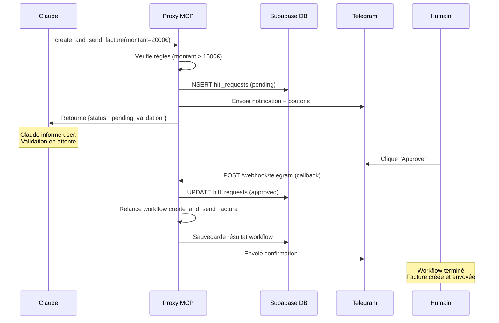

# HITL (Human In The Loop) - Architecture & Implementation

## 🎯 Vision

Système de validation humaine **transparente** intégré dans les workflows MCP, sans exposer de nouveau tool à Claude. La validation se fait via Telegram avec reprise automatique après approbation.

## 🏗️ Architecture

### Stack Technique

```
┌─────────────────────────────────────────────────────────────┐
│ Claude (Bot Telegram FlowChat)                              │
│   ↓ Appelle MCP tool: create_and_send_facture              │
└─────────────────────────────────────────────────────────────┘
                         ↓
┌─────────────────────────────────────────────────────────────┐
│ Proxy MCP (https://supabase.dsolution-ia.fr)               │
│                                                             │
│  1. Vérifie règles HITL (montant, nouveau client)          │
│  2. Si validation requise:                                  │
│     → Crée request en DB                                    │
│     → Envoie notification Telegram                          │
│     → Retourne status "pending_validation"                  │
│                                                             │
│  3. Humain clique bouton Telegram (Approve/Reject)         │
│     → Webhook reçoit callback                               │
│     → Met à jour DB                                         │
│     → Relance workflow original                             │
│     → Envoie confirmation Telegram                          │
└─────────────────────────────────────────────────────────────┘
                         ↑
                    Webhook POST
                         ↓
┌─────────────────────────────────────────────────────────────┐
│ Telegram Bot (@YourBot)                                     │
│   - Envoie notifications aux admins                         │
│   - Boutons inline: Approve / Reject / Modify               │
│   - Reçoit callbacks via webhook                            │
└─────────────────────────────────────────────────────────────┘
```

### Flux de Données



## 📁 Structure des Fichiers

### Nouveaux Fichiers

```
supabase-mcp-proxy/
├── schemas/
│   └── hitl_requests_schema.sql      # Table + fonctions Supabase
├── utils/
│   └── hitl.py                        # Logique HITL complète
├── setup_webhook.py                   # Script setup interactif
└── HITL_IMPLEMENTATION.md             # Ce fichier
```

### Fichiers Modifiés

```
├── requirements.txt                   # + python-telegram-bot, apscheduler
├── config.py                          # + Variables Telegram/HITL
├── main.py                            # + Endpoint /webhook/telegram + startup
└── tools/workflows.py                 # + Intégration HITL dans workflows
```

## 🔧 Configuration

### 1. Variables d'Environnement

Ajoutez au `.env` du proxy MCP :

```bash
# Telegram Bot Configuration
TELEGRAM_TOKEN=1234567890:ABCdefGHIjklMNOpqrsTUVwxyz  # De @BotFather
TELEGRAM_WEBHOOK_SECRET=votre_secret_aleatoire_securise   # Généré aléatoire
TELEGRAM_ADMIN_ID=123456789                          # Votre user ID
TELEGRAM_WEBHOOK_URL=https://supabase.dsolution-ia.fr/webhook/telegram

# HITL Configuration
HITL_ENABLED=true                     # Activer système HITL
HITL_TIMEOUT_MINUTES=30               # Timeout requêtes
HITL_FACTURE_THRESHOLD=1500.0         # Seuil validation (EUR)
```

### 2. Configuration Telegram Bot

#### Créer le Bot (@BotFather)

```
/newbot
- Nom: FlowChat HITL Bot
- Username: flowchat_hitl_bot

@BotFather vous donnera le TOKEN
```

#### Obtenir Chat ID

```bash
# 1. Envoyez /start au bot
# 2. Appelez l'API Telegram:
curl https://api.telegram.org/bot<TOKEN>/getUpdates

# 3. Trouvez "chat":{"id": 123456789}
```

#### Configurer Webhook (méthode automatique)

```bash
python setup_webhook.py
```

#### Configurer Webhook (méthode manuelle)

```bash
curl -X POST "https://api.telegram.org/bot<TOKEN>/setWebhook" \
  -H "Content-Type: application/json" \
  -d '{
    "url": "https://supabase.dsolution-ia.fr/webhook/telegram",
    "secret_token": "votre_secret",
    "drop_pending_updates": true
  }'
```

### 3. Base de Données Supabase

```bash
# Appliquer le schéma
psql -h <supabase-host> -U postgres -d postgres < schemas/hitl_requests_schema.sql

# Ou via Supabase Dashboard:
# → SQL Editor → Nouvelle query → Coller schemas/hitl_requests_schema.sql
```

### 4. Installation

```bash
cd supabase-mcp-proxy
pip install -r requirements.txt
```

### 5. Démarrage

```bash
# Démarrage normal (webhook configuré au startup)
python main.py

# Ou avec uvicorn
uvicorn main:app --host 0.0.0.0 --port 8000
```

## 🎮 Utilisation

### Règles de Validation HITL

Le système déclenche automatiquement une validation si :

1. **Montant > seuil** : Facture > 1500 EUR (configurable)
2. **Nouveau client** : Première facture pour l'entreprise
3. **Custom** : Extensible dans `needs_hitl_validation()``

### Workflow Normal (sans HITL)

```python
# Claude appelle via MCP
result = await dispatch_tool("create_and_send_facture", {
    "qualification_id": "uuid-123",
    "montant": 800,  # < 1500 EUR → pas de HITL
    "description": "Consultation"
})

# Retourne immédiatement :
{
    "success": true,
    "facture_id": "uuid-456",
    "pdf_url": "https://...",
    "email_sent": true
}
```

### Workflow avec HITL (validation requise)

```python
# Claude appelle via MCP
result = await dispatch_tool("create_and_send_facture", {
    "qualification_id": "uuid-123",
    "montant": 2500,  # > 1500 EUR → HITL déclenché
    "description": "Prestation importante"
})

# Retourne immédiatement (workflow pausé) :
{
    "success": false,
    "status": "pending_validation",
    "request_id": "uuid-789",
    "message": "⏳ Validation humaine requise. En attente d'approbation (timeout: 30 min)",
    "expires_at": "2026-02-17T15:30:00Z",
    "workflow_name": "create_and_send_facture"
}
```

### Notification Telegram

L'admin reçoit :

```
🔔 **Validation HITL Requise**

**Workflow**: `create_and_send_facture`
**Tool**: `create_and_send_facture`

**Paramètres**:
- Montant: **2500 €**
- Qualification ID: `uuid-123`
- Description: Prestation importante
- Email destinataire: Email entreprise

⏱️ Timeout: 30 minutes

👇 Choisissez une action ci-dessous:

[✅ Approuver] [❌ Rejeter] [✏️ Modifier]
```

### Réponse Humaine

**Scénario 1 : Approbation**

```
Humain clique "✅ Approuver"
→ Workflow reprend automatiquement
→ Facture créée et envoyée
→ Confirmation Telegram :

✅ **Validation APPROVE**

Request ID: `uuid-789`
Status: approved

**Résultat du workflow:**
{
  "success": true,
  "facture_id": "uuid-456",
  "pdf_url": "https://...",
  "email_sent": true
}
```

**Scénario 2 : Rejet**

```
Humain clique "❌ Rejeter"
→ Workflow arrêté
→ Confirmation Telegram :

❌ **Validation REJECT**

Request ID: `uuid-789`
Status: rejected

Workflow rejected by human validator
```

**Scénario 3 : Timeout**

```
Si aucune réponse après 30 min :
→ Scheduler marque request "timed_out"
→ Pas de reprise automatique
→ L'user peut relancer manuellement
```

## 🔍 API Reference

### Fonction Utilitaire : needs_hitl_validation

```python
async def needs_hitl_validation(
    workflow_name: str,
    params: Dict[str, Any]
) -> bool:
    """
    Détermine si workflow nécessite validation humaine
    
    Args:
        workflow_name: Nom du workflow
        params: Paramètres du workflow
        
    Returns:
        True si validation requise, False sinon
    """
```

### Fonction Utilitaire : perform_human_validation

```python
async def perform_human_validation(
    workflow_name: str,
    tool_name: str,
    params: Dict[str, Any],
    validation_context: Optional[Dict[str, Any]] = None
) -> Dict[str, Any]:
    """
    Effectue validation humaine via Telegram
    
    Returns:
        {
            "success": False,
            "status": "pending_validation",
            "request_id": "uuid",
            "message": "...",
            "expires_at": "ISO8601"
        }
    """
```

### Endpoint : POST /webhook/telegram

```python
@app.post("/webhook/telegram")
async def telegram_webhook(request: Request):
    """
    Reçoit callbacks Telegram
    
    Security: Vérifie X-Telegram-Bot-Api-Secret-Token
    
    Callback Data Format:
        hitl_approve:uuid → Approuve la requête
        hitl_reject:uuid → Rejette la requête
        hitl_modify:uuid → Modifier (non implémenté)
    """
```

## 📊 Base de Données

### Table : hitl_requests

```sql
CREATE TABLE hitl_requests (
    id UUID PRIMARY KEY,
    workflow_name TEXT NOT NULL,
    tool_name TEXT NOT NULL,
    original_params JSONB NOT NULL,
    status TEXT CHECK (status IN ('pending', 'approved', 'rejected', 'timed_out', 'modified')),
    validated_by TEXT,
    validated_at TIMESTAMPTZ,
    validation_decision JSONB,
    created_at TIMESTAMPTZ DEFAULT NOW(),
    expires_at TIMESTAMPTZ DEFAULT NOW() + INTERVAL '30 minutes',
    telegram_message_id TEXT,
    telegram_chat_id TEXT,
    workflow_result JSONB,
    error_details TEXT
);
```

### Fonctions RPC

```sql
-- Timeout automatique des requêtes expirées
SELECT timeout_expired_hitl_requests();

-- Récupérer une requête
SELECT * FROM get_hitl_request('uuid');

-- Mettre à jour statut
SELECT update_hitl_request_status(
    'uuid', 
    'approved', 
    'user@123', 
    '{"action": "approve"}'::jsonb
);
```

## 🧪 Tests

### Test Manuel

```bash
# 1. Créer facture avec montant élevé
curl -X POST https://supabase.dsolution-ia.fr/tools/call \
  -H "X-FlowChat-MCP-Key: your_key" \
  -H "Content-Type: application/json" \
  -d '{
    "name": "create_and_send_facture",
    "arguments": {
      "qualification_id": "uuid-123",
      "montant": 2500,
      "description": "Test HITL"
    }
  }'

# 2. Vérifier réponse "pending_validation"
# 3. Vérifier notification Telegram
# 4. Cliquer bouton "Approve"
# 5. Vérifier workflow terminé
```

### Test Timeout

```bash
# 1. Lancer requête HITL
# 2. Attendre 30 minutes
# 3. Vérifier scheduler a marqué "timed_out"
SELECT * FROM hitl_requests WHERE status = 'timed_out';
```

### Test Webhook

```bash
# Simuler callback Telegram
curl -X POST https://supabase.dsolution-ia.fr/webhook/telegram \
  -H "X-Telegram-Bot-Api-Secret-Token: your_secret" \
  -H "Content-Type: application/json" \
  -d '{
    "callback_query": {
      "data": "hitl_approve:uuid-789",
      "from": {"id": 123456789, "username": "admin"}
    }
  }'
```

## 🔐 Sécurité

### Protection Webhook

- **Secret Token** : Vérifié sur chaque callback Telegram
- **HTTPS obligatoire** : Telegram n'accepte que HTTPS pour webhooks
- **Rate limiting** : Protège contre spam (SlowAPI)

### Protection Base de Données

- **RLS activé** : Row Level Security sur `hitl_requests`
- **Service role** : Seul le proxy peut créer/modifier
- **Validation params** : JSONB validé côté application

### Protection Telegram

- **Bot token** : Jamais exposé publiquement
- **Admin chat ID** : Seuls admins reçoivent notifications
- **Callback validation** : Vérifie UUID valide avant traitement

## 🐛 Troubleshooting

### Webhook ne fonctionne pas

```bash
# Vérifier webhook configuré
curl https://api.telegram.org/bot<TOKEN>/getWebhookInfo

# Vérifier logs proxy
docker logs supabase-mcp-proxy | grep telegram

# Tester endpoint manuellement
curl https://supabase.dsolution-ia.fr/webhook/telegram
```

### Notifications non reçues

```bash
# Vérifier bot token valide
curl https://api.telegram.org/bot<TOKEN>/getMe

# Vérifier chat ID correct
# Envoyer /start au bot puis :
curl https://api.telegram.org/bot<TOKEN>/getUpdates

# Vérifier logs Telegram
docker logs supabase-mcp-proxy | grep hitl
```

### Timeout non déclenché

```bash
# Vérifier scheduler actif
docker logs supabase-mcp-proxy | grep scheduler

# Déclencher manuellement
SELECT timeout_expired_hitl_requests();
```

## 📈 Monitoring

### Métriques Clés

```sql
-- Requests en attente
SELECT COUNT(*) FROM hitl_requests WHERE status = 'pending';

-- Taux d'approbation
SELECT 
    status,
    COUNT(*) as count,
    ROUND(COUNT(*) * 100.0 / SUM(COUNT(*)) OVER (), 2) as percentage
FROM hitl_requests
WHERE status IN ('approved', 'rejected')
GROUP BY status;

-- Temps de réponse moyen
SELECT 
    AVG(EXTRACT(EPOCH FROM (validated_at - created_at))) as avg_seconds
FROM hitl_requests
WHERE validated_at IS NOT NULL;

-- Requests par workflow
SELECT 
    workflow_name,
    COUNT(*) as total,
    COUNT(*) FILTER (WHERE status = 'approved') as approved,
    COUNT(*) FILTER (WHERE status = 'rejected') as rejected
FROM hitl_requests
GROUP BY workflow_name;
```

### Logs Structlog

```python
# Dans les logs :
logger.info("hitl_validation_start", request_id=uuid, workflow=name)
logger.info("hitl_validation_sent", telegram_message_id=id)
logger.info("telegram_webhook_callback", action=action, user_id=user)
logger.info("hitl_workflow_resumed", request_id=uuid, status=status)
```

## 🚀 Extension

### Ajouter HITL à un Nouveau Workflow

```python
@register_tool(
    name="my_custom_workflow",
    category=ToolCategory.WORKFLOW,
    description_short="Custom workflow avec HITL"
)
async def my_custom_workflow_handler(params: Dict[str, Any]):
    from utils.hitl import needs_hitl_validation, perform_human_validation
    
    # Vérifier si validation requise
    if await needs_hitl_validation("my_custom_workflow", params):
        return await perform_human_validation(
            workflow_name="my_custom_workflow",
            tool_name="my_custom_workflow",
            params=params,
            validation_context={
                "custom_field": params.get("field"),
                "reason": "Custom validation reason"
            }
        )
    
    # Workflow normal
    # ...
```

### Ajouter Règles de Validation

```python
# Dans utils/hitl.py, fonction needs_hitl_validation

# Nouvelle règle : Valider si prospect STATUS = "cold"
if workflow_name == "create_and_send_facture":
    qualification_id = params.get("qualification_id")
    qualif_data = await call_supabase_rpc("get_qualification_by_id", ...)
    
    if qualif_data[0].get("status") == "cold":
        logger.info("hitl_required_cold_prospect")
        return True
```

### Ajouter Actions Webhook

```python
# Dans main.py, fonction telegram_webhook

if action == "modify":
    # Demander modifications à l'user
    await update.callback_query.answer(
        "Envoyez les nouveaux paramètres au format JSON",
        show_alert=True
    )
    # Attendre message suivant...
    # Appeler process_validation_response avec modified_params
```

## 📚 Références

- **Telegram Bot API** : https://core.telegram.org/bots/api
- **Webhooks Telegram** : https://core.telegram.org/bots/webhooks
- **python-telegram-bot** : https://docs.python-telegram-bot.org/
- **APScheduler** : https://apscheduler.readthedocs.io/
- **Supabase RLS** : https://supabase.com/docs/guides/auth/row-level-security

## 📝 TODO

- [ ] Implémenter action "Modify" avec saisie JSON
- [ ] Ajouter multi-admins (group chat support)
- [ ] Dashboard web pour gérer requêtes HITL
- [ ] Notifications par email (fallback si Telegram down)
- [ ] Analytics HITL (temps réponse, taux approval)
- [ ] Test suite automatisée (pytest)
- [ ] Documentation API OpenAPI

---

**Auteur** : Claude (GitHub Copilot)  
**Version** : 1.0.0  
**Date** : 2026-02-17
